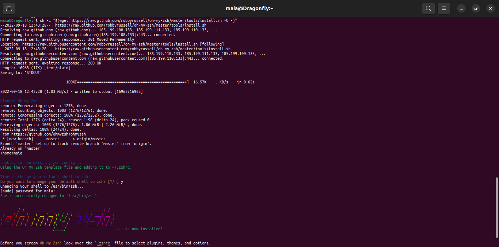

# Lab 0: Environment Set Up

## Tasks

### 1. **Install a UNIX-based operating system.**

The UNIX-like operating system I've chosen is *Ubuntu* since it is said to be more beginner and user-friendly, and being new to it decided to install as dual boot.

Met with a problem: Windows wouldn’t let me shrink the volume because there were immovable system files at the very end of the volume, gladly could solve it.

  

Ubuntu Disk Partitioning

-Created a **Root Partition**. This partition is mounted at **/**.

-We need a **paging file**, so created the **Swap Partition**. This partition is for **/swap**.

-Next created the **Home Partition**. This partition is mounted at **/home**.

Once the installation has completed, was prompted to restart my machine.

### 2. **Install essential tools.**

Installing the “starting pack” of a software engineer on my machine: 
> Installing Zsh in Ubuntu Linux

First, we will have to update the repository by running the following command:
	`sudo apt-get update`

Now we will install the zsh by running the following command:
	`sudo apt-get install zsh -y`

Now we have to make the zsh as our default shell using the following command:
`chsh -s /usr/bin/zsh`

Running a few more commands we can see it was successfully set as the default shell.

> Oh-My-Zsh, Git

> gcc compiler

> ide/editor(Visual Studio Code)

### 3. **Create a Git repository.**

After completing the task in **2**, we now will write the hello-world program in C. Compile it using GCC and Make.

* We type the command
	`gedit hello.c`
	
and enter the C source code below:

We close the editor window
	`gcc -o hello hello.c`
	
This command will invoke the GNU C compiler to compile the file hello.c and output (-o) the result to an executable called hello. 

* Compiling using Make.

All the manipulation were done through command line

1. Configuring GitHub

	`git config --global user.name "user_name"`
	
	`git config --global user.email "email_id"`
	
2. Creating a local repository

Created a folder on my system. This local repository will later be pushed onto the GitHub website. Used the following command:
	`git init OOP_Lab_0`
	
Change the directory to this newly created folder:
	`cd OOP_Lab_0`
	
3. Creating a README.md file to describe the repository
	`gedit README.md`
	
4. Adding repository files to an index: command line `git add file_name`

5. Committing changes made to the index: `git commit -m "some_message"`

6. Creating a repository on GitHub

7. Pushing files in a local repository to GitHub repository

The final step is to push the local repository contents into the remote host repository (GitHub), by using the command:
	`git push origin master`

